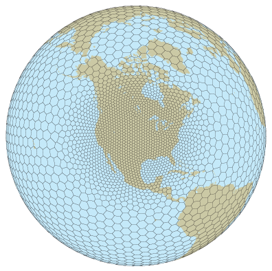
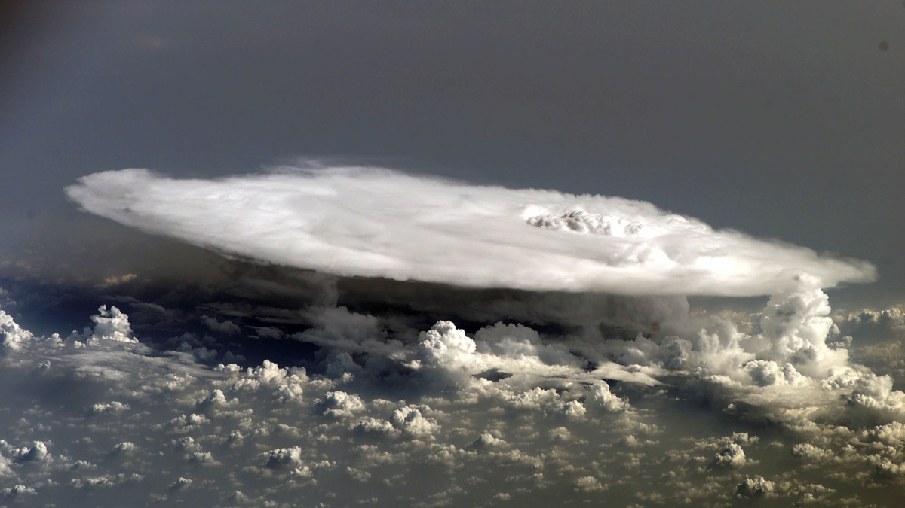

## Our Research Focus
  
Our team is dedicated to advancing the capabilities of atmospheric models to simulate the complex dynamics of the atmosphere. Success in this field critically depends on our ability to accurately represent the essential dynamics of the real atmosphere. To achieve this, we employ a variety of innovative approaches that continually push the boundaries of what atmospheric models can achieve. As we continue to advance the state of atmospheric science, our goal is to not only push the theoretical boundaries of atmospheric modeling but also to translate these advancements into practical forecasting tools that can provide significant societal benefits.
 

## Current Areas of Focus

#### Model Development

In the realm of model development, we primarily utilize the Weather Research and Forecasting (WRF) model and the Model for Prediction Across Scales (MPAS). Our objective is to enhance the fidelity and accuracy of these models, particularly for high-resolution simulations. We focus on refining numerical methods to improve the overall shape and performance of the models.
 

#### Error Growth

In the realm of model development, we primarily utilize the Weather Research and Forecasting (WRF) model and the Model for Prediction Across Scales (MPAS). Our objective is to enhance the fidelity and accuracy of these models, particularly for high-resolution simulations. We focus on refining numerical methods to improve the overall shape and performance of the models.
 

#### Mesoscale Convective System (MCS)

Another major area of our research involves the study of mesoscale convective systems, particularly those associated with heavy rainfall during the Changma, or East Asia Monsoon, in Korea. These systems pose significant simulation challenges, especially in terms of their onset and detailed dynamics. By employing high-resolution models, we seek to enhance our understanding and forecasting of these summer-time convective events.
 

#### AI for Weather Prediction
Additionally, we are exploring the use of artificial intelligence in atmospheric simulation. While AI for weather prediction is still in its early stages compared to traditional model simulation, it holds substantial potential for enhancing predictive performance. Inspired by the visionary ideas of Lewis Fry Richardson in the 1920s, who imagined a vast computational system for weather prediction, we are committed to developing a robust AI-driven prediction system for the future.